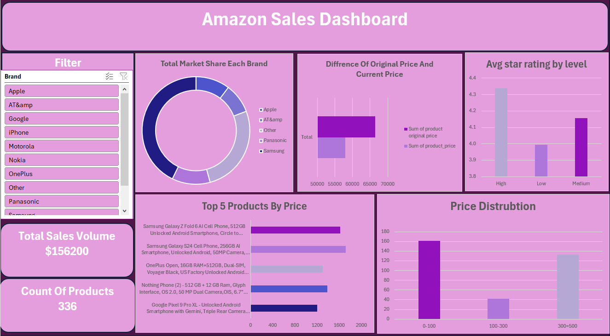

# Phone Sales Project

## 📌 Project Overview
This project involved building an Amazon Sales Dashboard in Excel to analyze product performance and pricing trends. The workflow included data cleaning and transformation with Power Query, creating data models and KPIs with Power Pivot, and using Pivot Tables & Charts to visualize key metrics. The final deliverable is an interactive dashboard with slicers for filtering by brand and clear visuals for decision-making.

---

## 🛠 Tools & Skills Used
- **Excel**: Power Query, PivotTables, Conditional Formatting  
- **Data Cleaning**: Removed duplicates, fixed errors, standardized formats  
- **Data Analysis**: Year-over-year comparison of sales & quantities  
- **Visualization**: Interactive dashboard with charts and slicers  

---

## 📂 Project Steps
1. **Data Cleaning & Preparation**  
   - Fixed missing/duplicate values  
   - Standardized product names and dates  
2. **Analysis**  
   - Created PivotTables for 2024 vs 2025 sales  
   - Added calculated fields for growth % and differences  
3. **Dashboard Design**  
   - Used slicers to filter by year/product  
   - Built charts showing performance comparison  

---

## 📊 Dashboard Insights

Total Sales Volume: $156,200 across 336 products.

Brand Market Share: Apple, Samsung, and other leading brands compared by share.

Price vs. Rating Analysis: Shows how product pricing levels align with average star ratings.

Top 5 Products by Price: Highlights the most expensive items and their contribution.

Price Distribution: Breakdown of products across price ranges (0–100, 100–300, 300–500).

KPI Cards: Quick overview of total sales and product count for instant insights
---
 
![Dashboard][(https://github.com/AhmedMedhatFarouk/tabali-sales-analysis-2024-2025/blob/main/image.png)]

